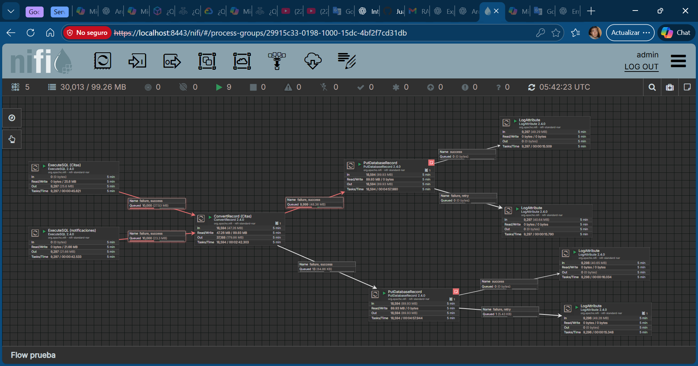

# Hospital Data Warehouse System

This project is a hospital data warehouse designed to centralize, integrate, and analyze operational and clinical data from multiple data sources, enabling analytics and reporting through dashboards.

The system was developed as part of an academic project and is currently being extended as a personal project.

---

## 🏥 Project Overview

The goal of this project is to design a scalable and modular data warehouse architecture for a hospital environment, supporting analytical queries related to patients, appointments, employees, and medical resources.

The system integrates data from multiple relational and non-relational databases and prepares it for visualization and decision-making.

---

## 🛠️ Technologies Used

- Docker & Docker Compose  
- PostgreSQL  
- SQL Server  
- MySQL  
- MongoDB  
- SQL (DDL & DML)  
- Power BI  
- REST APIs (data sources)  

---

## 🗂️ Architecture

- Multiple operational databases (SQL and NoSQL)
- Centralized data warehouse schema
- ETL processes for data extraction, transformation, and loading
- Containerized services for easy deployment
- Analytics layer using Power BI dashboards

*(Architecture diagrams can be added here in the future)*

---

## 🔄 ETL Process

- Data extraction from heterogeneous data sources
- Data transformation and normalization
- Loading into a centralized data warehouse schema
- Scheduled and automated execution (in progress)

---

## 📊 Analytics & Dashboards

The data warehouse supports dashboards for:
- Appointments per patient (completed and pending)
- Patient origin and hospital locations
- Employees per hospital (by role and gender)
- Medical facilities and resources
- Document volume per patient

Dashboards are implemented using **Power BI**.

---

## 📌 Current Status

🚧 **Work in Progress**

Planned improvements include:
- Full automation of ETL pipelines
- Data quality validation
- Incremental loading strategies
- Improved dimensional modeling
- Additional Power BI dashboards

---

## 👤 Author & Role

- Designed the overall architecture
- Implemented database schemas and ETL logic
- Containerized the system using Docker
- Integrated analytics with Power BI

---

## 📷 Screenshots / Diagrams

